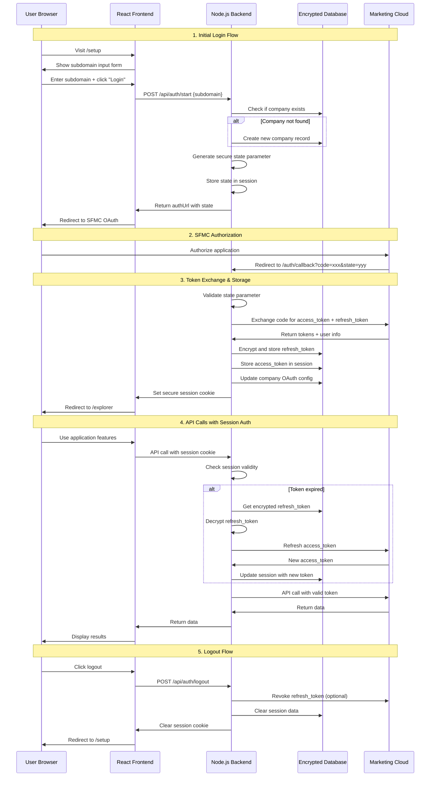

# OAuth 2.0 Flow Architecture

## Complete OAuth Flow Diagram



## Security Flow Details

### State Parameter Validation
```
┌─────────────────┐    ┌──────────────────┐    ┌─────────────────┐
│   1. Generate   │    │   2. Store in    │    │   3. Validate   │
│   Random State  │───▶│   Session        │───▶│   on Callback   │
│                 │    │                  │    │                 │
│ crypto.random   │    │ req.session.     │    │ req.query.state │
│ Bytes(32)       │    │ oauthState       │    │ === session     │
└─────────────────┘    └──────────────────┘    └─────────────────┘
```

### Token Storage & Encryption
```
┌─────────────────┐    ┌──────────────────┐    ┌─────────────────┐
│  Raw Tokens     │    │   AES Encryption │    │   Database      │
│                 │    │                  │    │                 │
│ refresh_token   │───▶│ encrypt(token,   │───▶│ encrypted_      │
│ client_secret   │    │ ENCRYPTION_KEY)  │    │ refresh_token   │
│                 │    │                  │    │                 │
└─────────────────┘    └──────────────────┘    └─────────────────┘
```

### Session Management
```
┌─────────────────┐    ┌──────────────────┐    ┌─────────────────┐
│   HTTP Cookie   │    │   Session Store  │    │   Database      │
│                 │    │                  │    │                 │
│ sessionId       │───▶│ in-memory or     │───▶│ sessions table  │
│ httpOnly: true  │    │ Redis (prod)     │    │ session_data    │
│ secure: true    │    │                  │    │                 │
│ sameSite: lax   │    │                  │    │                 │
└─────────────────┘    └──────────────────┘    └─────────────────┘
```

## Multi-Tenant Isolation

Each company has completely isolated:
- OAuth configuration (subdomain, client_id, encrypted client_secret)
- Session data and tokens
- API usage tracking
- User permissions and plan limits

```
Company A                    Company B
┌─────────────┐             ┌─────────────┐
│ Sessions    │             │ Sessions    │
│ - session_1 │             │ - session_3 │
│ - session_2 │             │ - session_4 │
│             │             │             │
│ OAuth Config│             │ OAuth Config│
│ - subdomain │             │ - subdomain │
│ - client_id │             │ - client_id │
│ - encrypted │             │ - encrypted │
│   secrets   │             │   secrets   │
└─────────────┘             └─────────────┘
```

## Error Handling & Edge Cases

### Invalid State Parameter
```
User tries to access callback with tampered state
└─► Backend validates state !== session.oauthState
    └─► Return 400 error, redirect to login
        └─► Clear session data for security
```

### Expired Refresh Token
```
API call fails with 401
└─► Attempt token refresh
    └─► Refresh token expired/invalid
        └─► Clear session, redirect to login
            └─► User must re-authorize
```

### Network Failures
```
Token exchange fails
└─► Retry with exponential backoff (3x)
    └─► Log error for monitoring
        └─► Show user-friendly error message
            └─► Allow retry from setup page
```

This OAuth implementation follows industry best practices and is designed for enterprise security requirements, including Salesforce AppExchange compliance.
